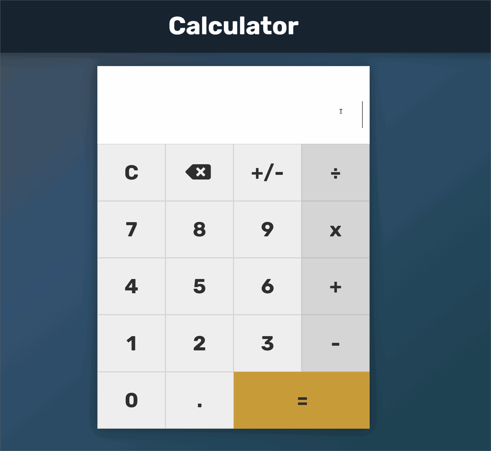

# Calculator
A basic web calculator with keyboard support.

--------
Try it here: https://foolmonkey.github.io/calculator/

----
To begin, try entering in a math expression with your keyboard or mouse! Press 'Enter' or click the '=' button to calculate.

Built with vanilla HTML5, CSS3, and Javascript.

-----

